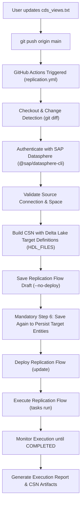

# Fully Automated SAP Datasphere Replication Flows

Automate end-to-end SAP Datasphere Replication Flows directly from Git commits using GitHub Actions. All operations execute remotely on GitHub-hosted runners with zero local computer execution.

---

## Architecture & Workflow


```mermaid
flowchart TD
    A["User updates cds_views.txt"] --> B["git push origin main"]
    B --> C["GitHub Actions Triggered (replication.yml)"]
    C --> D["Checkout & Change Detection (git diff)"]
    D --> E["Authenticate with SAP Datasphere (@sap/datasphere-cli)"]
    E --> F["Validate Source Connection & Space"]
    F --> G["Build CSN with Delta Lake Target Definitions (HDL_FILES)"]
    G --> H["Save Replication Flow Draft (--no-deploy)"]
    H --> I["Mandatory Step 6: Save Again to Persist Target Entities"]
    I --> J["Deploy Replication Flow (update)"]
    J --> K["Execute Replication Flow (tasks run)"]
    K --> L["Monitor Execution until COMPLETED"]
    L --> M["Generate Execution Report & CSN Artifacts"]
```

---

> [!IMPORTANT]
> **Data Lake File Storage Type Spaces (`HDL_FILES` / `DWC_HDLF`):**
> If your Datasphere space uses **Data Lake File storage type**, target data is stored as **Delta Lake / Parquet files** in SAP HANA Data Lake Files (`DWC_HDLF`).
> - **Standard relational Local Tables are NOT used or created** in an HDL_FILES space; they do not appear under the "Local Tables" tab in Data Builder.
> - Instead, target entities are created as **Delta Lake file entities** (`@DataWarehouse.persistence.hdlf.tableFormat: DELTA_LAKE`) embedded directly in the CSN document.
> - The files are stored in the Data Lake Files container under `/<space_name>/<target_entity_name>/`.

---

## 1. CDS View Input

Input CDS Views via `cds_views.txt` in the root of the repository:

```text
# Enter one CDS View technical name per line.
# Blank lines and lines starting with '#' are ignored.

I_BILLINGFREQUENCY
I_BILLINGFREQUENCY_TEXT
I_CURRENCYTEXT
```

- **Format:** One CDS View name per line.
- **Consolidation:** All active CDS views are consolidated into a **single Replication Flow** (`RF_CONSOLIDATED` or custom `FLOW_NAME`).
- **Comments & Blank Lines:** Ignored automatically.
- **Change Detection:** Only newly added or changed CDS Views are processed in subsequent runs. Existing flows and targets are preserved.

---

## 2. GitHub Secrets & Variables Configuration

Configure your GitHub repository: **Settings** → **Secrets and variables** → **Actions**.

### Required Secrets (Repository Secrets)

| Secret Name | Description | Example |
| :--- | :--- | :--- |
| `DATASPHERE_HOST` | SAP Datasphere tenant host URL | `https://my-tenant.hcs.cloud.sap` |
| `CLIENT_ID` | OAuth 2.0 Client ID | `sb-clone-123!b456...` |
| `CLIENT_SECRET` | OAuth 2.0 Client Secret | `wXyZ123456...` |
| `AUTHORIZATION_URL` | OAuth 2.0 Authorization URL | `https://my-tenant.authentication.sap.hana.ondemand.com/oauth/authorize` |
| `TOKEN_URL` | OAuth 2.0 Token URL | `https://my-tenant.authentication.sap.hana.ondemand.com/oauth/token` |

### Required Variables or Secrets (Repository Variables)

| Variable Name | Description | Example | Default |
| :--- | :--- | :--- | :--- |
| `SOURCE_SPACE` | Technical ID of the source Datasphere space | `RAD_S3X` | *(Required)* |
| `SOURCE_CONNECTION` | Technical ID of the source connection | `S3XReplicationflows` | *(Required)* |
| `SOURCE_CONTAINER` | Source container/namespace | `CDS_EXTRACTION` | `CDS_EXTRACTION` |
| `TARGET_CONNECTION` | Target connection technical ID | `DWC_HDLF` | `DWC_HDLF` |
| `FLOW_NAME` | Custom name for the consolidated Replication Flow | `RF_CONSOLIDATED` | `RF_CONSOLIDATED` |
| `LOAD_TYPE` | Replication load mode (`INITIAL` or `INITIAL_AND_DELTA`) | `INITIAL` | `INITIAL` |
| `STATUS_TIMEOUT_SEC` | Maximum seconds to wait for flow run completion | `600` | `600` |
| `STATUS_POLL_INTERVAL_SEC`| Seconds between status checks | `15` | `15` |

---

## 3. Official 9-Step Automation Sequence (Data Lake Files / HDL_FILES)

To guarantee 100% deployment reliability and target entity persistence in Data Lake File storage spaces (`HDL_FILES`), the pipeline follows SAP's official 9-step sequence:

| Step | Operation | Implementation Detail |
| :--- | :--- | :--- |
| **1** | **Authenticate using Datasphere technical user** | Headless OAuth2 client credentials pre-fetch & `@sap/datasphere-cli login` |
| **2** | **Create or update Replication Flow** | Checks space for existing technical name & initializes consolidated flow |
| **3** | **Configure source objects** | Maps source CDS view columns, keys, and extraction container |
| **4** | **Generate target Delta Lake definitions (CSN)** | Embeds full Delta Lake entity definitions (`DELTA_LAKE` format, CDC annotations) directly into CSN |
| **5** | **Save Replication Flow draft** | Saves flow draft with `--no-deploy` to register replication tasks and target bindings |
| **6** | **Save again to persist target objects (Mandatory)** | Executes mandatory second save to validate target persistence; fails if unpersisted |
| **7** | **Deploy Replication Flow** | Deploys flow and active bindings via `update` (with `--deploy-anyway` fallback) |
| **8** | **Execute Replication Flow** | Triggers execution task via `datasphere tasks replication-flows run` |
| **9** | **Monitor replication status** | Polls `datasphere tasks replication-flows status` until `COMPLETED` |

> [!TIP]
> **Why Embedding Target Definitions in CSN Solves the Issue:**  
> In SAP Datasphere Data Lake File storage spaces, target entities are Delta Lake datasets on `DWC_HDLF`. By embedding the target entity `definitions` directly at the root of the Replication Flow CSN payload, SAP's CDS Compiler compiles both the Delta Lake target entities and the replication tasks together. Coupled with the mandatory Step 6 second save, this guarantees that target objects are persisted without draft locks or greyed-out states.

---

## 4. Manual Execution & Overrides

You can trigger the workflow manually from the **Actions** tab in GitHub:
- Click **SAP Datasphere Replication Flows** → **Run workflow**.
- Check **Force replication of all CDS Views** to bypass git diff and re-replicate all views declared in `cds_views.txt`.
